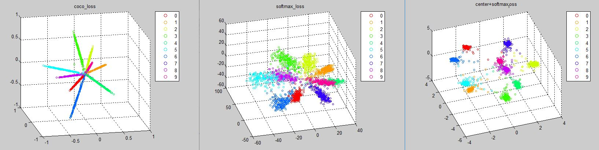

# COCO Loss

Codebase for Learning Deep Features via Congenerous Cosine Loss for Person Recognition, [[arXiv]](https://arxiv.org/abs/1702.06890). In the paper, we use the newly proposed [PIPA](https://people.eecs.berkeley.edu/~nzhang/piper.html) dataset for evaluation; it is a large-scale dataset for person recognition. 

We provide a sample code for generating distributions of COCO Loss, Softmax Loss and Center Loss as Figure 3 in our paper. Please follow the steps below:

## Runing sample code

1. Compile [CaffeMex_v2](https://github.com/sciencefans/CaffeMex_v2/) with matlab interface 

2. Link (Linux) or copy (Windows) the path `CaffeMex_v2/matlab/+caffe` to the root directory in this project

3. Run `script_show_minist.m`

4. It takes just few seconds to generate three figures as:

Notice that the distributions are generated based on caffemodels in `model/[LOSS_NAME]`. You can reproduce the result by using network definition files in `model/train_prototxts/`.

The proposed COCO loss layer (known as `center_projection_layer.cu` [here](https://github.com/sciencefans/CaffeMex_v2/blob/master/src/caffe/layers/center_projection_layer.cu)) and the normalized layer ([here](https://github.com/sciencefans/CaffeMex_v2/blob/master/src/caffe/layers/normalize_layer.cu)) are two operations related wiht COCO. The gradient derivation in the initial release (v1) on arXiv is **wrong**; please resort to v2 (latest version): Eqn.(8) in v2 paper corresponds to the implementation around lines [here](https://github.com/sciencefans/CaffeMex_v2/blob/master/src/caffe/layers/normalize_layer.cpp#L55).

## Q&A

Here we list some commonly asked questions we received from the public. Thanks for your engagement to make our work matter!

- *Relationship of person recognition task with face recognition, person Re-ID.*

	Face recognition is the traditional vision task to recognize a person's identify based solely on face (often with some setting constraints, like frontal faces); whereas the context of person recognition carries more. The main difference between person recognition and re-id resides in the data logistics. The former is to identify the same person across places and time. In most cases, the identity varies a lot in appearance under different occasions. The latter is to detect person in a consecutive video, meaning that the appearance and background do not vary much in terms of time.

- *Training curve looks weird. Any tricks to make COCO work?*

	Hah, good question. There are mainly two. First is we initialize the network with a pre-trained model for the re-id task in order for the loss to converge well in a large-scale dataset like PIPA; second is we do not normalize the feature to 1. There are some numerical problems for gradients of centroids if we  normalize all features and weights to 1. In MNIST, we initialize the scaler to 1 for weights and 2 for features while in PAPA we set 30 and 100, respectively.

<!-- - *Why do you not release the whole codebase for the person recognition pipeline?*
	
	Good quetion the second. There are many side things you need to take care of: pretrain the models, crop patches, alignment, score merging from regions, etc. So we just skip this part. -->

## Still having questions?

Feel free to drop us an email sharing your ideas.

## Related work

Please refer to the paper for details.

- Cosine Normalization: Using Cosine Similarity Instead of Dot Product in Neural Networks, [[link]](https://arxiv.org/abs/1702.05870), *arXiv, 2017*.

- Large-Margin Softmax Loss for Convolutional Neural Networks, [[link]](http://jmlr.org/proceedings/papers/v48/liud16.pdf), *ICML, 2016*.

## Citation
Please kindly cite our work in your publications if it helps your research:

    @article{liu_2017_coco,
      Author = {Liu, Yu and Li, Hongyang and Wang, Xiaogang},
      Title = {Learning Deep Features via Congenerous Cosine Loss for Person Recognition},
	  Journal = {arXiv preprint: 1702.06890},
	  Year = {2017}
    }
